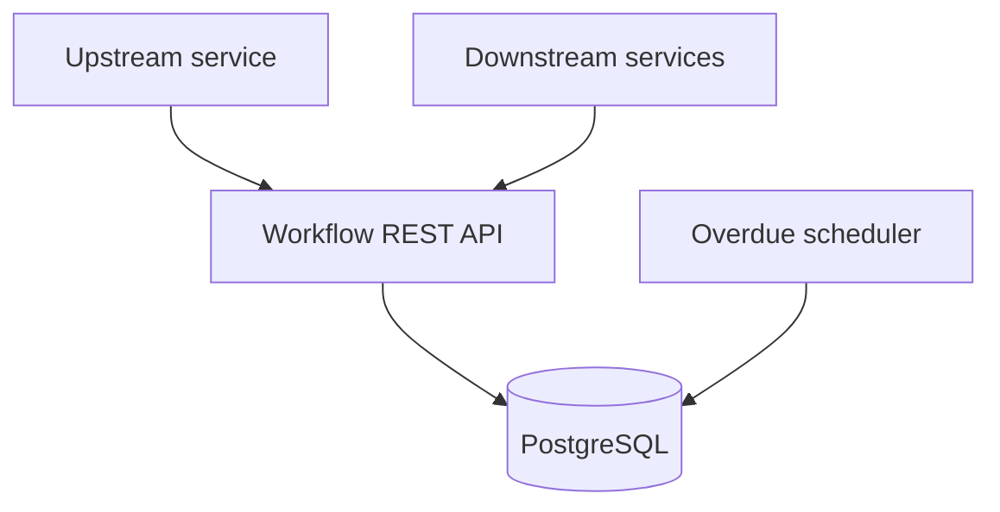

# Architecture

The service tracks one asynchronous workflow event and the acknowledgement expected from each downstream service.

## State transitions

`PENDING` becomes `COMPLETED` when every expected service acknowledges. A pending workflow becomes `FAILED` after its acknowledgement deadline. Completed and failed workflows are terminal.

## Consistency

Acknowledgement and failure transitions run in a transaction and lock the workflow row. The acknowledgement table has a unique constraint for `(workflow_id, service_name)`, which is the final database safety net against duplicate records.

## Scope

The first version focuses on tracking correctness. Kafka publishing, authentication, and alert delivery are separate extensions documented in the roadmap.
